# Milestone 1
Team Name: 

Member's Name: Xirui Li, Yanyi Wang

## Proposal 
### Target user
Our target users are profeesors teaching in lager classrooms.Since three of us are all UCSD students, so none of us is in the traget user group.

### Decription of our team's idea 

Due to the large amount of students in the classroom, professors need a better way to keep students' attension, record their attendance, and get student's feedbacks. In order to achieve this we will build a web app that can increase interactions between professors and students during class and help the professors get more timely feedback from students.  

In details: 
1)instead of using iclickers or signing up sheet, we will use our app to do both facial recognission and GPS tracking to make sure the attendace will be taken properly. 
2)To give professors more timely feedbacks, we will allow students to comment on the slide during the lecture, so the professor can adjust his pace acrooding to students feedbacks.
3)Choosing A,B,C is one of the quick and easy way to interacte with class, but the answer alone dose not show understading. Allow students to give more explainations is great, but the professor do not have time to read through all the resposes due class size. In our app, we want to extract the most common key word in students responds. Therefore, the professor will know how well the students understand the materials.
4)After each lectures, we may require students to give more feedback on the lecture to help the professor adjust their teaching style. 

### Possible API 
 
To take attendance, we may use google cloud API to do facial recognision and read GPS locataion. We may also use google classroom API to create classes, distribute assignments, send feedback, and see everything in one place.

### 1st Storyboard 
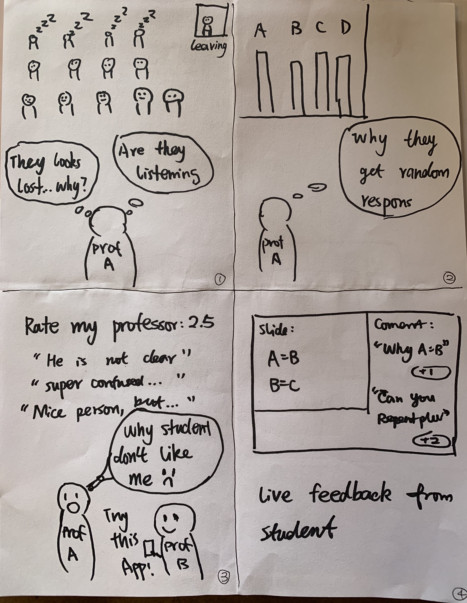
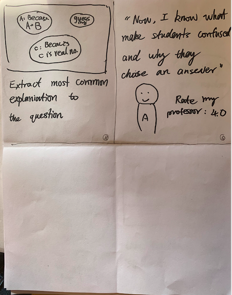

### 2rd Storyboard 
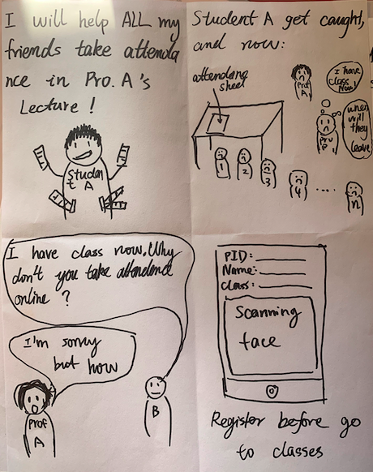
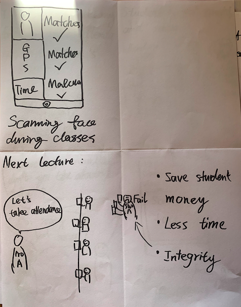

### 1st Prototype
### 2rd Prototype
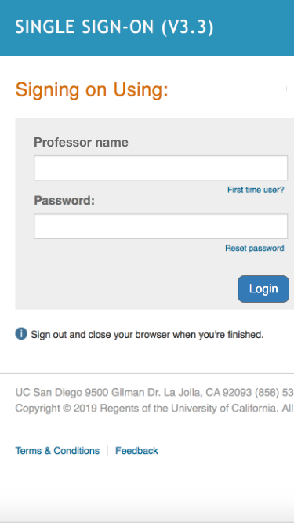
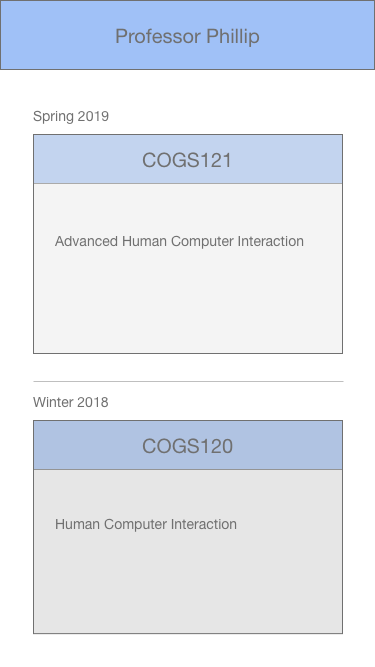
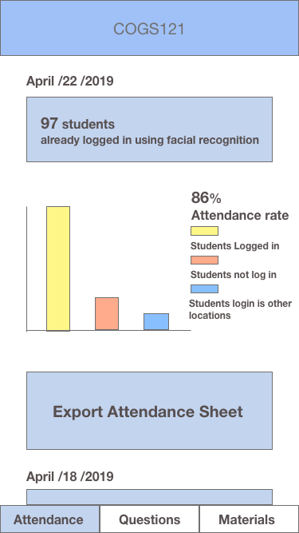
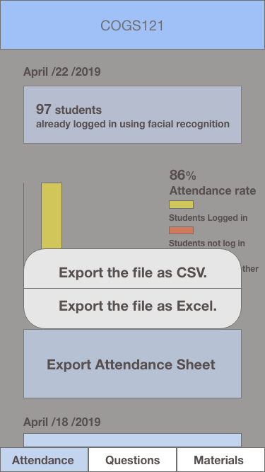
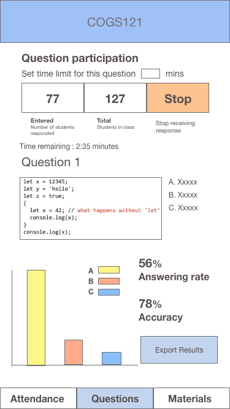
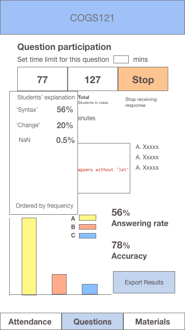
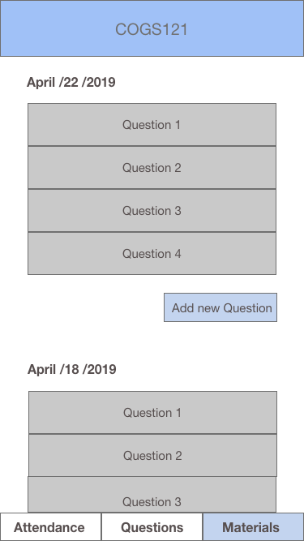
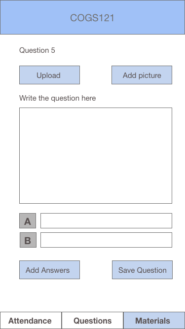

