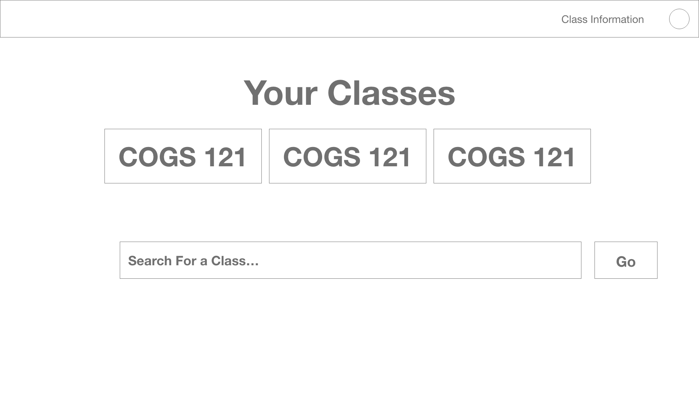
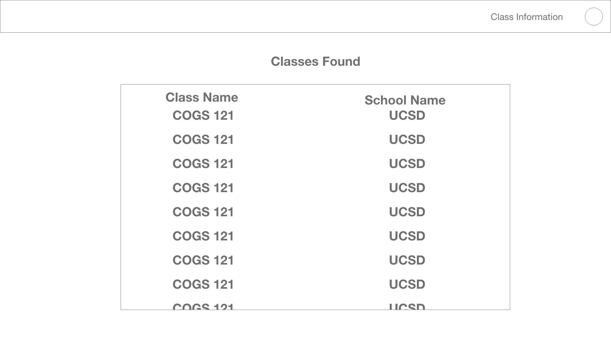
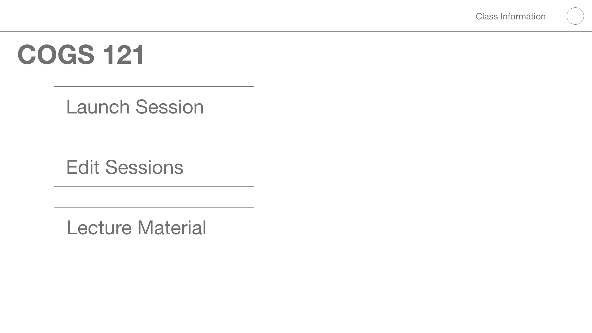
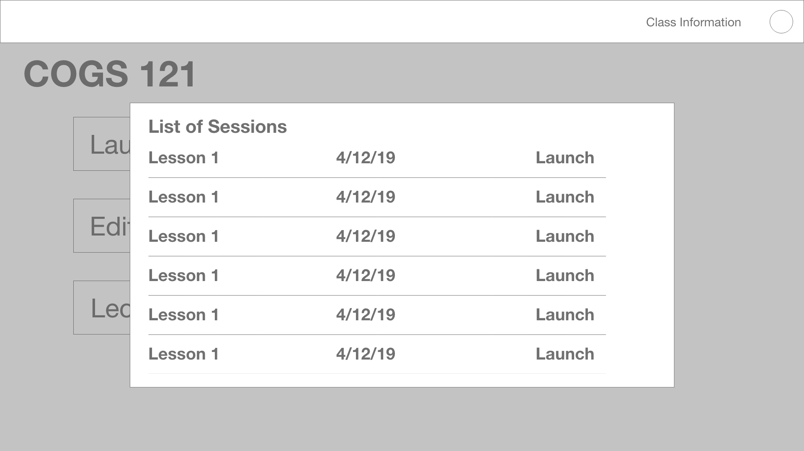
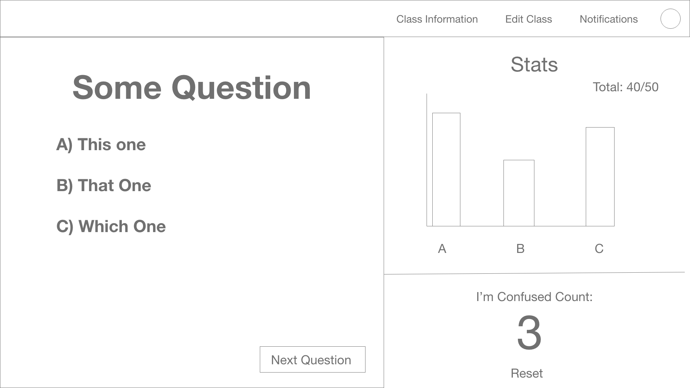
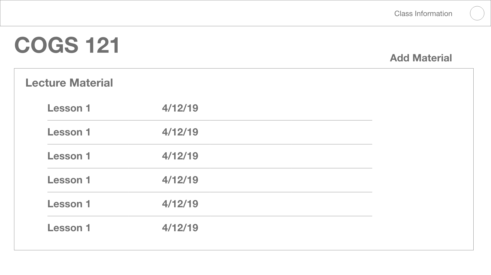
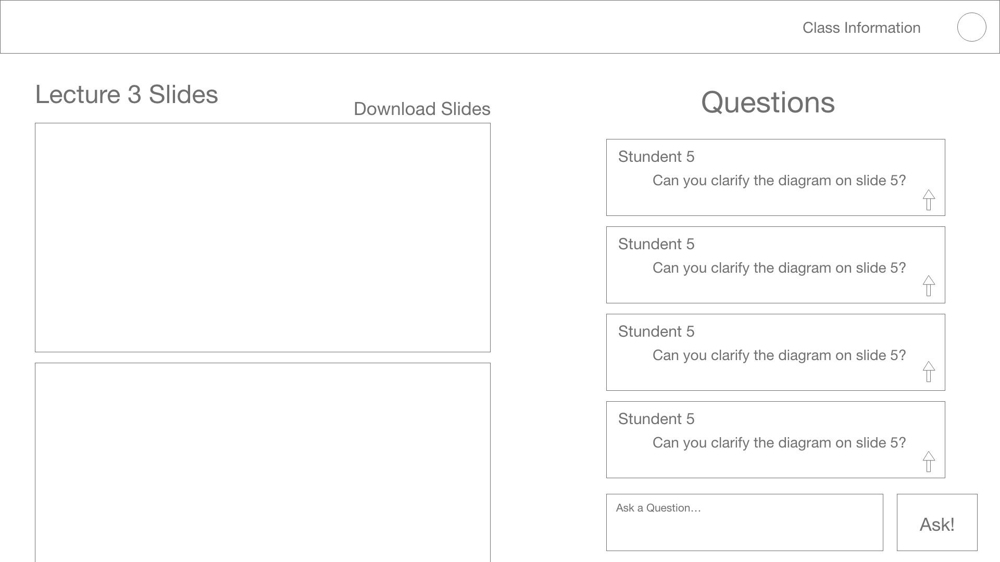
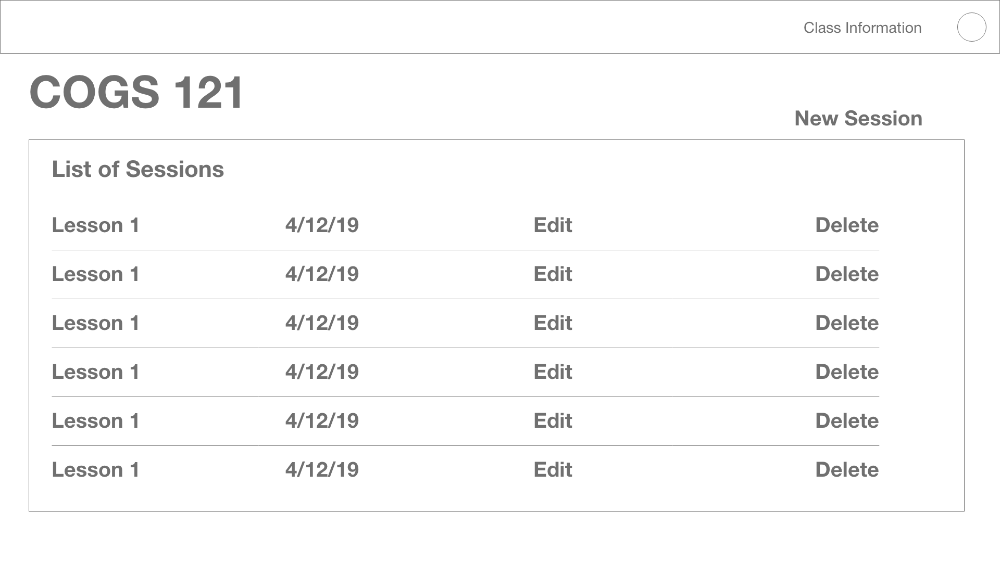
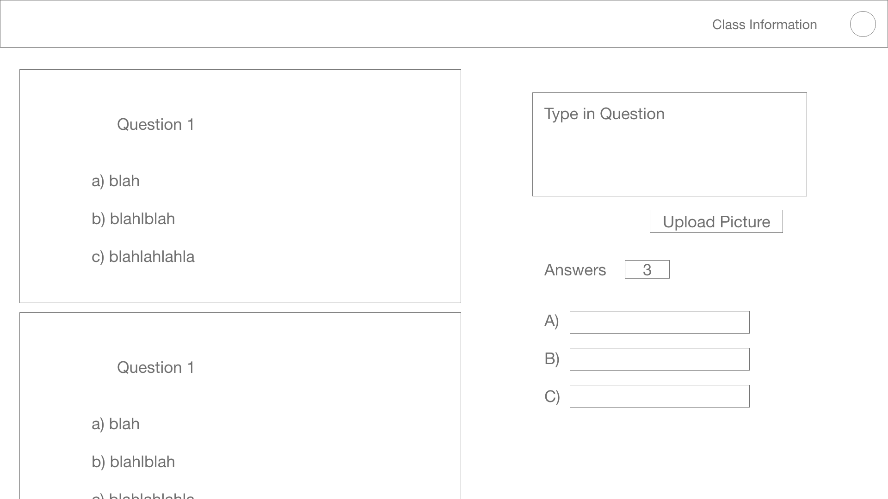
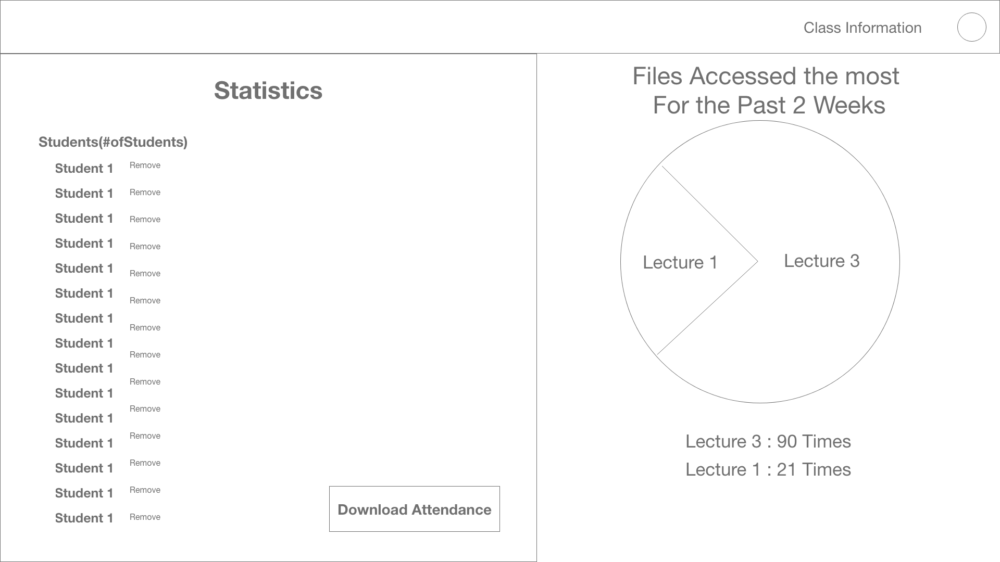

# Milestone 1
Team Name: Y.S.V 

Member's Name: Xirui Li, Yanyi Wang, Vincent Alday

## Proposal 
### Target user
Our target users are professors teaching in larger classrooms. Since the three of us are students and do not hold any teaching positions, we do not fall under our target group.

### Decription of our team's idea 

Due to the large amount of students in the classroom, we believe that professors need a better way to keep students' attention, record their attendance, and student feedback. In order to achieve this, we will build a web app that can increase interactions between professors and students during class and help professors get more timely feedback from students to improve the class experience.  

In detail: 
1) Instead of using iclickers or signi up sheet, we will use our app to do both facial recognition and GPS tracking to make sure the attendance will be taken properly. 
2) To give professors more timely feedbacks, we will allow students to comment on the slide during the lecture, so the professor can adjust their pace based on student feedback.
3) Choosing A,B,C is one of the quick and easy way to interacte with class, but the answer alone does not show understanding. Giving students the ability to explain their answer is great, but unfortunately professors do not have time to read through all the resposes due class to size. In our app, we want to extract the most common key word in students responses. With this method, the professor can get a grasp on how well the students absorbed the material.
4) After each lecture, we may require students to give more feedback on the lecture to help the professor adjust their teaching style. 

### Possible API 
 
To take attendance, we may use google cloud API to do facial recognition and read GPS location. We may also use google classroom API to create classes, distribute assignments, send feedback, and help organize everything in one place.

### Alternate Project Ideas
When coming up with our original idea, we were concerned that our idea was too similar to piazza and IClicker. We thought of these ideas just in case our original idea does not go through.

Another idea is to create an app for blind and visually impaired people. Our group members all have normal vision. The App will enable our target users to take a picture of any text in front of them and use audio feedback to read out the text. 

Another idea that we had was an app aimed at small business owners. This app would help them with organizing finances, work schedules, work duties among employees, stock of items, and a way to organize data for sales etc... 

### 1st Storyboard 

### 2rd Storyboard 

### 1st Prototype
Landing Page

Selecting Class

Home Page For Class

Launching Session

Active Session

Lecture Material List ( After Selecting "Lecture Material" )

Lecture Slides With Questions

List of Sessions ( After Selecting "Edit Sessions" )

Creating/Editing Session

Class Information

### 2rd Prototype

